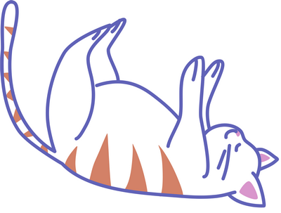

# Кото-API — Документация

Добро пожаловать в документацию Кото-API — простого и наглядного сервера для взаимодействия с виртуальным котом через REST API.

Здесь вы найдете описание доступных эндпоинтов для получения статуса кота, кормления, игры и поглаживания.

API построено с учетом стандартов OpenAPI, что позволяет удобно тестировать запросы через Swagger UI.

---

> **Важно:** Несмотря на кажущуюся простоту, кот может быть капризным — внимательно следите за ответами сервера и соблюдайте формат запросов.

---

Документация предназначена для разработчиков и инженеров, заинтересованных в изучении основ REST API на практике, а также для тех, кто просто любит котов.

---

Перейдите в раздел **API Справочник** для детального описания методов и примеров запросов.
